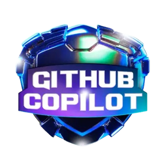

<pre style="font-size: 0.6rem;">

                              \\\\\\
                           \\\\\\\\\\\\
                          \\\\\\\\\\\\\\\
-------------,-|           |C>   // )\\\\|    .o88b. db   db  .d8b.  db    db  .d8b.  d888888b d888888b d88888b
           ,','|          /    || ,'/////|   d8P  Y8 88   88 d8' '8b 88    88 d8' '8b '~~88~~' '~~88~~' 88'  
---------,','  |         (,    ||   /////    8P      88ooo88 88ooo88 Y8    8P 88ooo88    88       88    88ooooo 
         ||    |          \\  ||||//''''|    8b      88~~~88 88~~~88 '8b  d8' 88~~~88    88       88    88~~~~~ 
         ||    |           |||||||     _|    Y8b  d8 88   88 88   88  '8bd8'  88   88    88       88    88.   
         ||    |______      ''''\____/ \      'Y88P' YP   YP YP   YP    YP    YP   YP    YP       YP    Y88888P
         ||    |     ,|         _/_____/ \
         ||  ,'    ,' |        /          |                 ___________________________________________
         ||,'    ,'   |       |         \  |              / \                                           \ 
_________|/    ,'     |      /           | |             |  |                                            | 
_____________,'      ,',_____|      |    | |              \ |      chavatte@duck.com                     | 
             |     ,','      |      |    | |                |                        chavatte.42web.io   | 
             |   ,','    ____|_____/    /  |                |    ________________________________________|___
             | ,','  __/ |             /   |                |  /                                            /
_____________|','   ///_/-------------/   |                 \_/____________________________________________/ 
              |===========,'                                                                              
			  

</pre>

# **Bootcamp Microsoft AI for Tech - GitHub Copilot**

Este repositório contém os projetos desenvolvidos durante o Bootcamp Microsoft AI for Tech - GitHub Copilot. Aqui, você encontrará exemplos práticos e experimentos que demonstram o poder do GitHub Copilot para aumentar a produtividade e a criatividade no desenvolvimento de software.

## Objetivo

O Bootcamp tem como objetivo transformar desenvolvedores em usuários avançados do GitHub Copilot, capazes de integrar a ferramenta em seu fluxo de trabalho e aumentar significativamente sua produtividade.

## Conteúdo Programático

O Bootcamp aborda os seguintes tópicos:

* **Introdução ao GitHub Copilot:** Visão geral da ferramenta, seus recursos e como começar a utilizá-la.
* **Integração com IDEs:** Como configurar e usar o GitHub Copilot em diferentes IDEs, como Visual Studio Code, IntelliJ IDEA, etc.
* **Geração de código:**  Explorar as capacidades do Copilot na geração de código em diversas linguagens de programação, como Python, JavaScript, Java, C#, etc.
* **Boas práticas:** Dicas e truques para usar o Copilot de forma eficiente, incluindo como escrever prompts eficazes e como lidar com sugestões inesperadas.
* **Aplicações práticas:** Demonstração de como o Copilot pode ser usado em diferentes cenários, como desenvolvimento web, automação de tarefas, análise de dados e muito mais.

## Projetos

### [LAB-01: Criando um Validador de Bandeiras de Cartão de Crédito com o GitHub Copilot](./projects/LAB-01/README.md)

## Certificado de conclusão

 🎓 [Bootcamp Microsoft AI for Tech - GitHub Copilot]()
